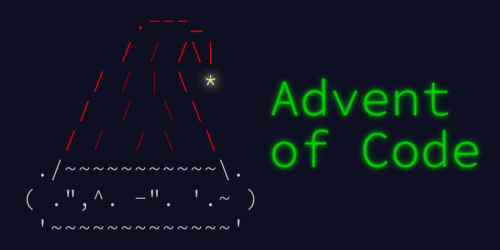

# 🎄 Advent_of_Code_2023 🎄
Every year I'm doing this with a new language. This year I chose **C++**!

Advent of Code is an Advent calendar of programming puzzles that can be solved in any programming language you like.
A new set of puzzles is supplied every day as the advent of that day.

If you are interested in the problems, you can find them ***[here](https://adventofcode.com/2023/events)***.

I did this to get more familiar with **C++**, solve programming puzzles, and, of course, for fun.

## 🔨 To improve

As I'm writing this later, I should've kept the commit history clean and try to do more exercises during those holidays. I also don't want to modify the files to preserve the timestamps.

I still wanted to keep this repository here on github mainly to track my progress.
